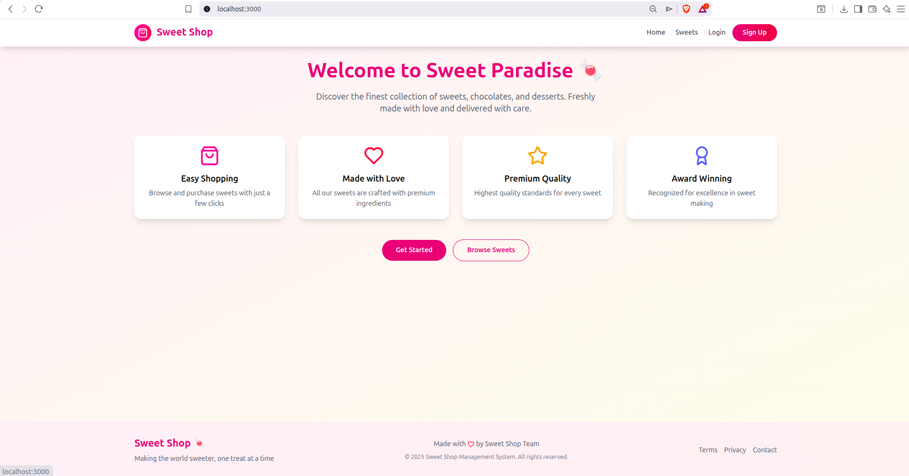
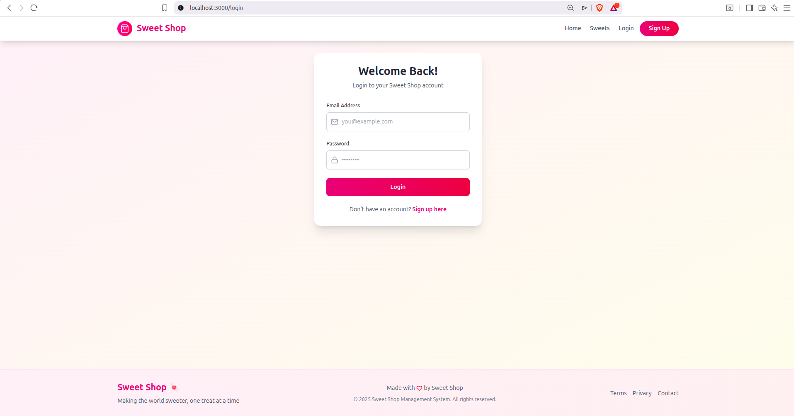
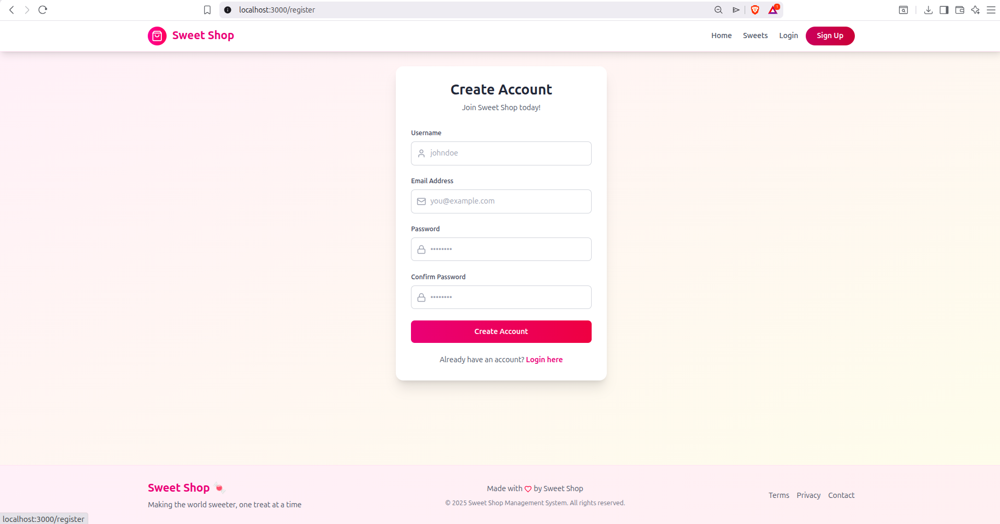
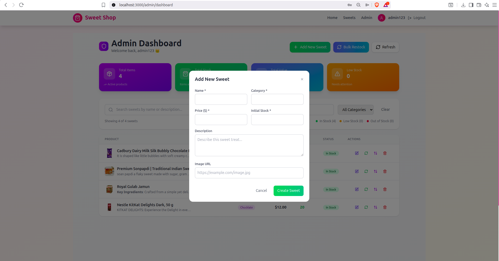
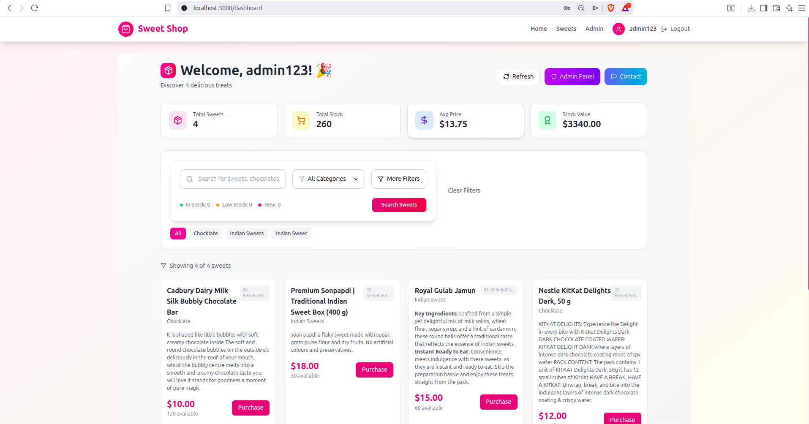

# Sweet Shop Management System

A full-stack Sweet Shop Management System built with a React (Vite) frontend and Flask backend, designed to manage products, orders, users, and authentication efficiently.

# Login as admin
    email: admin123@gmail.com
    Password: admin123

# Login as user
    Username: user@gmail.com
    Password: user123

# Frontend:-

   - React (Vite)

   - JavaScript

   - Axios

   - Tailwind / CSS

   - React Router

# Backend

   - Python 3.10+

   - Flask-RESTful

   - Flask-JWT-Extended

   - MongoDB

   - Pytest

# Prerequisites

Make sure you have the following installed:

   - Node.js (v18+ recommended)

   - npm or yarn

   - Python (3.10 or higher)

   - Git

# Backend Setup
  #  1️⃣ Navigate to Backend Directory
    cd Sweet_Shop_Management_System/backend

 #   2️⃣ Create Virtual Environment
    python3 -m venv venv

 #   3️⃣ Activate Virtual Environment

    Linux / macOS

    source venv/bin/activate

 #   4️⃣ Install Dependencies
        pip install -r requirements.txt

#    5 Run Backend Server
        uvicorn app.main:app --reload

        uvicorn app.main:app --reload --host 0.0.0.0 --port 8000

# Open the application in your browser:

   http://127.0.0.1:8000/
   
# Run Backend Tests;-
   pytest -v

# 🌐 Frontend Setup (React + Vite)
   # 1️⃣ Navigate to Frontend Directory
        cd Sweet_Shop_Management_System/frontend

   # 2️⃣ Install Dependencies
     npm install

  #  3 Start Frontend Server
        npm run dev

# Use this path
    http://localhost:3000/

## 📸 Application Screenshots

### 🏠 Home Page

### 🔐 Login Page

### 📝 Register Page

### 👤 User Dashboard

### 🛠️ Admin Dashboard

### ➕ Admin – Add Sweet

### 🍬 Admin – Sweets List

# My AI Usage

This project was developed with the responsible assistance of AI tools to enhance productivity, problem-solving, and technical understanding. AI tools were used as supportive assistants, not as replacements for core development or decision-making.

# 🔧 AI Tools Used

ChatGPT (OpenAI)
Used for debugging support, conceptual explanations, and documentation assistance.

DeepSeek
Used for alternative perspectives on implementation logic, backend structure, and optimization suggestions.

# 🛠️ How I Used These AI Tools

Used ChatGPT to:

Understand and resolve backend errors (e.g., Uvicorn startup issues, Pydantic validation errors, JWT configuration problems).

Clarify concepts such as FastAPI setup, JWT authentication, environment variable management, and ASGI server usage.

Assist in writing and structuring project documentation, including the README.md.

Improve code readability by refactoring logic after understanding AI suggestions.

Used DeepSeek to:

Explore alternative approaches for API route structuring and backend logic.

Validate design decisions by comparing multiple implementation strategies.

Review and improve edge-case handling in authentication and configuration logic.